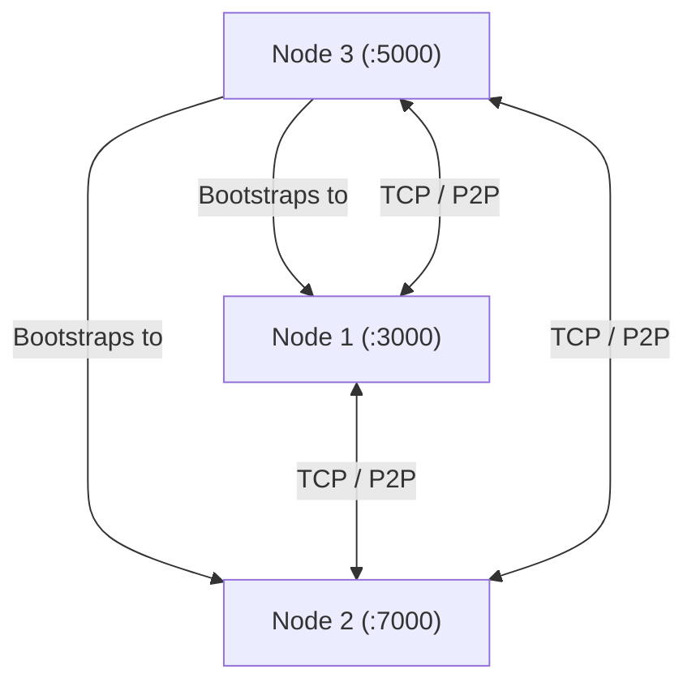
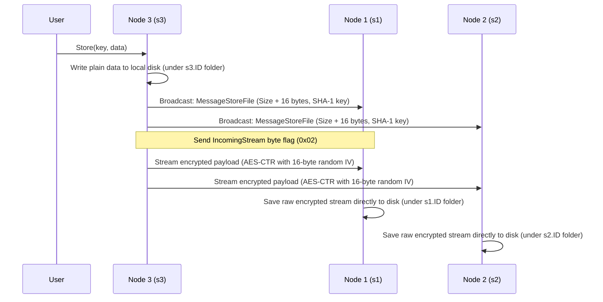
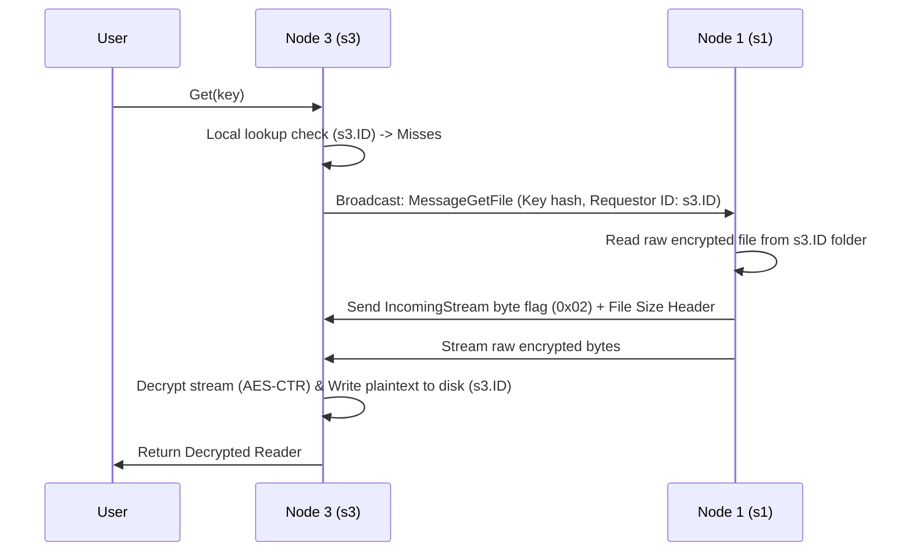

# Distributed Content-Addressable Storage (DFS)

A modular, peer-to-peer (P2P), encrypted, and Content-Addressable Storage (CAS) distributed file system written in Go. This project implements low-level network transports, message framing, AES-CTR streaming encryption, and hashed directory structures from scratch without relying on complex external frameworks.

---

## Architecture Overview

The system is designed as a decentralized network of autonomous storage nodes (peers) communicating over TCP. Every node functions as both a client (uploading and requesting files) and a server (persisting files on disk and streaming them to other peers on demand).



---

## Core Characteristics

### 1. Distributed File System (DFS)
The project demonstrates core distributed systems capabilities:
* **Decentralized Topology**: Peers discover and connect to each other using bootstrap nodes configured on startup.
* **Network-Wide Replication**: When a node stores a file, it simultaneously writes a local copy and streams the encrypted bytes to all connected peers in its routing table.
* **Network Retrieval**: If a node queries a file that has been deleted locally, it broadcasts a retrieval request to the P2P network, pulls the encrypted stream from a peer, decrypts it, and restores it locally.

### 2. Content-Addressable Storage (CAS)
Rather than identifying files by arbitrary user-defined paths or filenames, files are addressed by their cryptographic hashes.
* **Deterministic Hashing**: Files are written to disk using a path generated from their key's SHA-1 hash.
* **Directory Partitioning**: To prevent folders from growing too large (which degrades OS filesystem performance), the 40-character hex string hash is split into 5-character segments, creating a nested directory structure.
  
  For example, if the file key is `"bestpicture"`, it is handled as follows:
  * **SHA-1 Hash**: `71056ad8aa24742ea41ea36fa2e3452a31636e82`
  * **Resolved Path**: `71056/ad8aa/24742/ea41e/a36fa/2e345/2a316/36e82`
  * **Resolved Filename**: `71056ad8aa24742ea41ea36fa2e3452a31636e82`

---

## Data & Communication Flow

### Store Protocol (Replication)
When you store a file on a node, it is saved locally in plaintext and transmitted encrypted across the network.



### Get Protocol (Retrieval)
If a local lookup fails, the node requests the file from the network.



---

## Cryptography

The project uses symmetric cryptography (AES-256 in CTR mode) to protect files:
1. **Encryption (`copyEncrypt`)**:
   * Generates a unique 16-byte cryptographically secure random Initialization Vector (IV).
   * Writes the 16-byte IV to the head of the stream.
   * Encrypts the remaining plaintext with the cipher block and streams it.
2. **Decryption (`copyDecrypt`)**:
   * Reads the first 16 bytes from the stream to extract the IV.
   * Initializes the AES-CTR cipher stream using the extracted IV and the symmetric key.
   * Decrypts the remaining stream and writes it to the destination.

---

## Custom Connection-Locking Protocol

To avoid mixing RPC structure parsing (using Go's `gob` decoder) and raw binary streaming over the same TCP connection:
1. The transport read loop continuously decodes 1-byte headers from the peer connection.
2. **`IncomingMessage` (0x01)**: The payload is treated as a standard serialized RPC message (Gob).
3. **`IncomingStream` (0x02)**: The transport read loop encounters the streaming flag, spawns a `WaitGroup.Add(1)` block, and **pauses reading**.
4. The higher-level `FileServer` reads exactly `msg.Size` bytes of raw file stream directly from the connection socket via `io.LimitReader`.
5. Once the file transmission is complete, the `FileServer` calls `peer.CloseStream()`, releasing the `WaitGroup` and resuming the connection's read loop.

---

## Execution Guide

### Prerequisites
* Go 1.18 or higher
* Make utility (optional but recommended)

### Commands

* **Build the Project**:
  ```bash
  make build
  ```
  This compiles the source code into the `bin/dfs` executable.

* **Run the Simulation**:
  ```bash
  make run
  ```
  This runs the test bootstrap sequence defined in `main.go`. It spins up three virtual nodes on ports `:3000`, `:7000`, and `:5000`. It performs 20 store-delete-retrieve iterations to show local deletion and network recovery.

  > [!IMPORTANT]
  > **macOS Port Conflict Warning**: 
  > By default, macOS uses ports `:5000` and `:7000` for **AirPlay Receiver**. If AirPlay Receiver is active, running the simulation will fail with `bind: address already in use`. 
  > To fix this:
  > 1. Go to **System Settings > General > AirDrop & Handoff** and turn off **AirPlay Receiver**.
  > 2. Alternatively, edit the port parameters in [main.go](file:///Users/keshavbansal/keshav/DFS/main.go#L44-L46) to use alternative ports (e.g. `:3000`, `:7001`, `:5001`).

* **Run Tests**:
  ```bash
  make test
  ```
  Runs the complete suite of store, transport, and encryption unit tests.

---

## Critical Gaps & Incomplete Features

While functional as a proof of concept, several severe architectural limitations must be addressed before this system can be deployed in production:

### 1. The Peer ID Subdirectory Query Defect (Critical)
> [!CAUTION]
> **Severe Retrieval Bug**: 
> Currently, the physical storage layer organizes files inside folders prefixed with the node ID of the peer that uploaded or holds the file:  
> `storage_root / {NodeID} / {Hash_Path}`
> 
> * **Store**: Node `A` uploads a file. Peers save it locally under subdirectory `A`.
> * **Get**: Node `B` wants the file. It sends a `MessageGetFile` with `msg.ID = B`.
> * **Failure**: Peers look for the file inside subdirectory `B`, failing to locate it because it is stored under subdirectory `A`. 
> 
> **Solution**: Remove the node ID prefix from the physical file paths in `store.go`, allowing files to be stored purely by their content address (`storage_root / {Hash_Path}`) regardless of who uploaded or requested them.

### 2. Lack of Key Exchange Protocol
> [!WARNING]
> Nodes generate random 32-byte symmetric encryption keys independently on startup (`newEncryptionKey()`). In order for peers to successfully decrypt files pulled from other nodes, all nodes must share or negotiate the exact same symmetric key. A key exchange protocol (such as Diffie-Hellman) or secure configuration management is needed.

### 3. Vulnerable TCP Decoder Buffer
> [!WARNING]
> The `DefaultDecoder.Decode` function uses a fixed 1028-byte buffer to read message payloads from the socket:
> ```go
> buf := make([]byte, 1028)
> n, err := r.Read(buf)
> ```
> If an RPC message metadata payload exceeds 1028 bytes (e.g., extremely long file keys or large struct headers), it will be truncated, causing Gob deserialization errors and crashing the peer's connection handler. 
> 
> **Solution**: Implement length-prefixed packet framing (e.g., write the payload length as a 4-byte big-endian integer before writing the payload).

### 4. Naive Broadcast Engine
> [!NOTE]
> The server broadcasts messages by iterating through all active peers synchronously. This approach does not scale in a wide-area network and creates head-of-line blocking. The system needs a DHT (such as Kademlia) or a gossip-based communication protocol (like Epidemic Broadcast) to route messages efficiently.

### 5. Missing Network Handshake Verification
> [!NOTE]
> The `HandshakeFunc` defaults to `NOPHandshakeFunc`. In a secure distributed file system, nodes must execute handshakes to exchange protocol versions, discover other active peer lists, and authenticate via cryptographic tokens.

---

## Architectural Critique & Opinion

This codebase is an **excellent, clean, and highly educational demonstration of low-level networking in Go**. Writing raw TCP sockets, handling custom framing/streaming states via `sync.WaitGroup`, and implementing cryptographic pipelines on input streams showcase a strong grasp of systems programming.

### What is done well:
* **Stream Pipeline Efficiency**: The use of `io.TeeReader`, `io.MultiWriter`, and `io.LimitReader` means files are streamed block-by-block without ever reading the entire file into memory. This ensures the system can handle multi-gigabyte files with minimal memory overhead.
* **Separation of Concerns**: The abstraction between the physical storage manager (`store.go`), the crypto engine (`crypto.go`), the transport mechanics (`p2p/tcp_transport.go`), and the coordinator (`server.go`) is highly modular and easy to extend.

### Areas for Improvement:
* **Error Resilience**: The background connection loops drop connections instantly upon any read/decode error. For a distributed system, a retry strategy, heartbeats (pings/pongs), and connection pooling are required.
* **Decoupling Virtual Nodes**: The codebase uses the node ID to partition files on the local filesystem, primarily because the test harness in `main.go` runs all nodes in the same local directory. Running separate node processes with distinct configurations (environment variables or config files) is a much cleaner way to separate disk directories and eliminates the need for nesting directories by Node ID.
